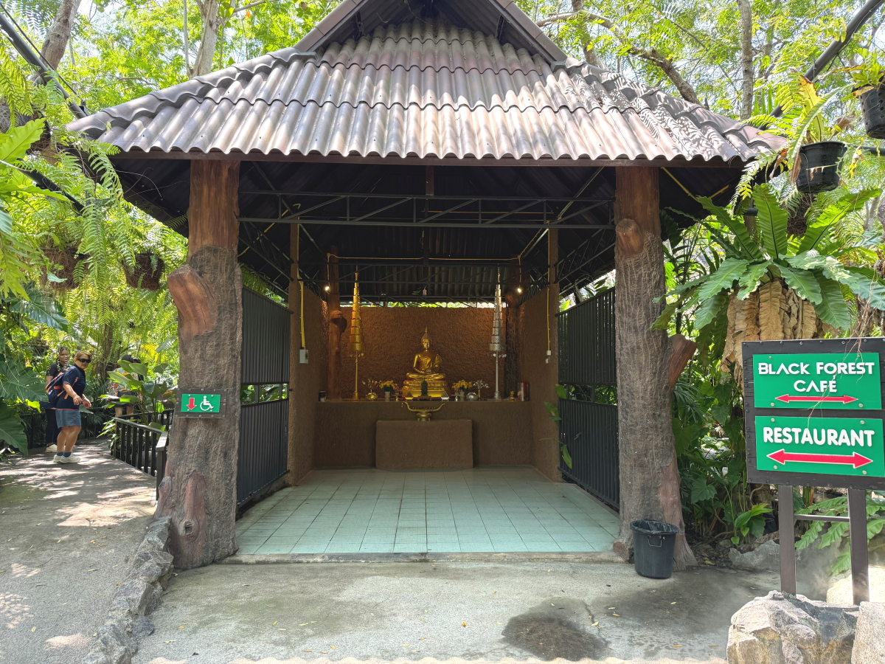
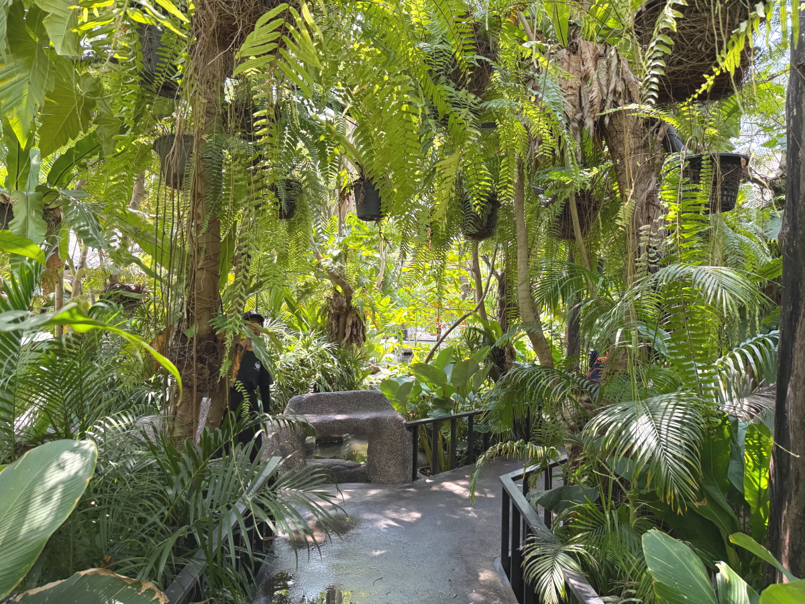
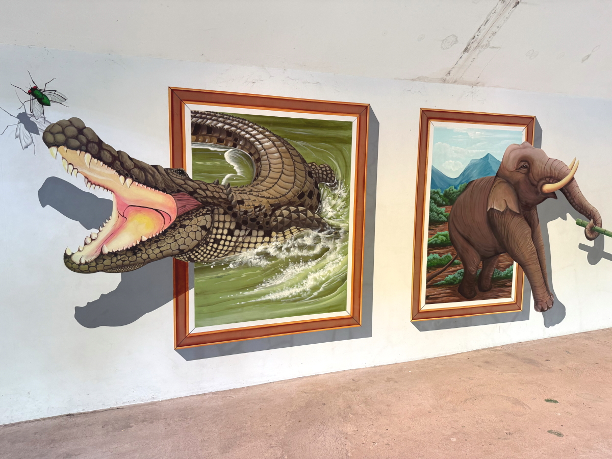
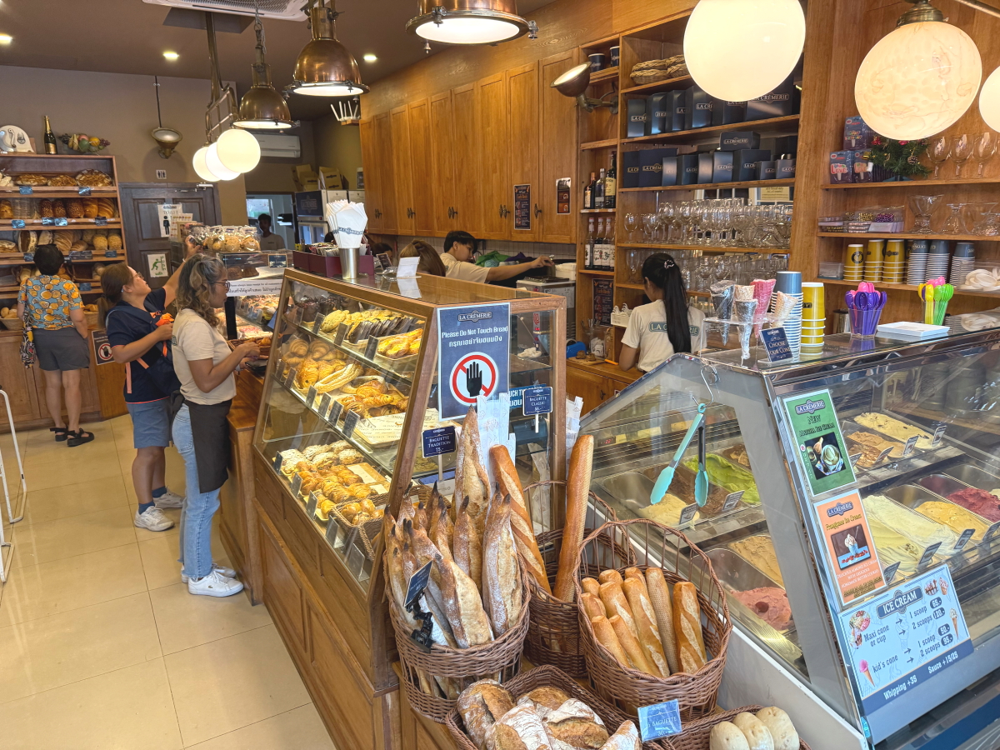

# 20250302_phattaya

<html>
<head>

<meta charset="UTF-8">
<meta http-equiv="Content-Type" content="text/html; charset=UTF-8">
<meta http-equiv="X-UA-Compatible" content="IE=EmulateIE10" />
<meta http-equiv="X-UA-Compatible" content="IE=edge">

<meta name="viewport" content="width=device-width, initial-scale=1.0">

<!--ここから上はお決まりの定型文です-->

<!--ここからが表現の書式などを決めるcssという部分-->

<link href="https://cdnjs.cloudflare.com/ajax/libs/lightbox2/2.7.1/css/lightbox.css" rel="stylesheet">

</head>

<body>

モバイル端末をお使いの場合は、画面を横向きにすると
より見やすくご覧頂けます。

<!--ここ上は、ほぼそのまま使います！-->

<!--QRコードの挿入例-->

 アクセス用QRコード

<marquee direction="left" scrollamount="20" width="30%">(^_^)/~alis</marquee>

<!--流れ文字の挿入例-->
<h1><marquee behavior="left">!!! 2025/03/02、パタヤ2日目は市内のレストランとデザートのお店!!!</marquee></h1>

                          

<!--ここから下が、本体部分-->

<h2>パタヤの朝は宿泊施設のお掃除係のミーティングから 朝7:54</h2>

    
<h2>この建物がロビーですが、漏れてくるWi-Fiの電波を拝借しました</h2>

    
<h2>ロビーの中に建物の模型がありました</h2>

    
<h2>プールはすでにリゾート地状態</h2>

<h2>街中の路地を走り抜けてお昼のレストランに向かいます</h2>

    
<h2>レストランの場所、名前は「Black Forest」</h2>
<iframe src="https://www.google.com/maps/embed?pb=!4v1740911292741!6m8!1m7!1s0OBpYKDc5yxAvZkHmq8LHw!2m2!1d12.85027153533906!2d100.9359732335977!3f184.71820792370258!4f-1.9369231575331156!5f3.3063857723354073" width="600" height="450" style="border:0;" allowfullscreen="" loading="lazy" referrerpolicy="no-referrer-when-downgrade"></iframe> 

    
<h2>さすが熱帯、一見レストランには見えません</h2>

    
<h2>おうむの横を抜けて入り口を入ると、中は森林探検状態</h2>

    
<h2>池のほとりの席に案内されました</h2>

    
<h2>おこぼれ狙いの猫ちゃんがミャーミャーと鳴きます</h2>

<h2>お水のボトルにQRコード、GoogleMapsのリンクでした</h2>

    
<!--

-->
    
<h2>タイっぽく金ピカの紋章</h2>

    
<h2>池の彫り物はでっかいカエル</h2>

<h2>デザートのお店に移動します</h2>
<iframe src="https://www.google.com/maps/embed?pb=!4v1740911879925!6m8!1m7!1sD4_E4SEg1eGDqTv_qYAuwQ!2m2!1d12.89579504306417!2d100.9061289796004!3f281.22620373679337!4f-0.9754711901217519!5f0.7820865974627469" width="600" height="450" style="border:0;" allowfullscreen="" loading="lazy" referrerpolicy="no-referrer-when-downgrade"></iframe> 

    
<h2>お客さんは欧米系</h2>

    
<h2>熱帯の太陽のもと、コッテリデザート</h2>

    
<h2>レジの周りはパンコーナーでした</h2>

    
<h2>ここでもワンちゃんが店の冷気で涼んでます</h2>

<h2>ホームセンターで雑貨品の購入</h2>

<h2>面白かったのは便座が大小二重になってて、小さな子供対応してました</h2>

    

    
<h2>最初のレストランの会計462バーツ、約2,000円</h2>

    
<h2>宿泊施設内にWi-Fiルームがあったので、こちらでデータ処理 子供達はネット対戦ゲーム中のようです</h2>

<!--   
  
<h2>今日のBGMは 移動で疲れたので癒し系 【120万再生感謝🌙】聴き流すだけで奇跡が起きる… 月のカノン</h2>
<iframe width="560" height="315" src="https://www.youtube.com/embed/lJxdEHg9cqA?si=6vr6iynbUdvMm-gF" title="YouTube video player" frameborder="0" allow="accelerometer; autoplay; clipboard-write; encrypted-media; gyroscope; picture-in-picture; web-share" referrerpolicy="strict-origin-when-cross-origin" allowfullscreen></iframe> 
-->

<!--
  
<h2>メタバース「cluster」内のイベントで「雪の約束」by まいてゃさん ダンサーの玖遠さんがトラブってみんなでステージダンスになりました</h2>
  
        <h2>MP4ファイルの再生</h2>
    <video controls width="640">
        <source src="2025-02-26 yukinoyakusoku by maitiya.mp4" type="video/mp4">
        お使いのブラウザは video タグをサポートしていません。
    </video>
-->

  
<h2>まいてゃさんアルバム MBG 2502 10kyoku 再掲です</h2>
<iframe width="560" height="315" src="https://www.youtube.com/embed/xVTSe-eXbFs?si=1YAnLelZqsU-zs0m" title="YouTube video player" frameborder="0" allow="accelerometer; autoplay; clipboard-write; encrypted-media; gyroscope; picture-in-picture; web-share" referrerpolicy="strict-origin-when-cross-origin" allowfullscreen></iframe> 

        <h2>「雪の中で輝くシンデレラ」by まいてゃ 再掲です</h2>
<h2><a href="https://torokoid.github.io/20250219_chiangrai/maitiyaz.mp3" target="_blank">この文字クリックで再生します 下の再生ボタンでも同じ曲流します</a></h2>

    <audio controls loop>
        <source src="https://torokoid.github.io/20250219_chiangrai/maitiyaz.mp3" type="audio/mpeg">
        お使いのブラウザは audio タグをサポートしていません。
    </audio>
    
<!--
  
<h2>スティーブ・ジョブズの伝説の講義</h2> 
<iframe width="560" height="315" src="https://www.youtube.com/embed/XsRpvWHIVw0?si=f7IA0pv9iZWVk3VH" title="YouTube video player" frameborder="0" allow="accelerometer; autoplay; clipboard-write; encrypted-media; gyroscope; picture-in-picture; web-share" referrerpolicy="strict-origin-when-cross-origin" allowfullscreen></iframe>    
    
    
<h2>スティーブ・ジョブズ氏の講義の内容が「笑って死ぬ」by まいてゃ さんの歌の内容と大筋で同じに聞こえます 以下に再掲しますね</h2>

    
<h3>歌の後半部分しか撮れてませんが、2月16日のイベントで公開された「笑って死ぬ」 by まいてゃ 白ドレスはダンサーの玖遠さん、黒いドレスがまいてゃさん</h3>
<iframe width="560" height="315" src="https://www.youtube.com/embed/s4ZcbxAluMM?si=Xa32xo19UCNaWv0v" title="YouTube video player" frameborder="0" allow="accelerometer; autoplay; clipboard-write; encrypted-media; gyroscope; picture-in-picture; web-share" referrerpolicy="strict-origin-when-cross-origin" allowfullscreen></iframe> 
-->
    
<!--
    <h3>お気に入りの「笑って死ぬ」 by まいてゃさんも再々掲です</h3>
<h2><a href="https://torokoid.github.io/20250221_chiangrai/maitiya3.mp3" target="_blank">この文字クリックで再生します 下の再生ボタンで同じ曲をループ再生します</a></h2>

    <audio controls loop>
        <source src="https://torokoid.github.io/20250221_chiangrai/maitiya3.mp3" type="audio/mpeg">
        お使いのブラウザは audio タグをサポートしていません。
    </audio>
 -->

   
<h2>以上、パタヤ2日目に巡ったレストランとデザートのお店でした。 ここまでご覧いただきありがとうございました。</h2>

     
<h2>
<a href="https://torokoid.github.io/20241126_chiangrai/" target="_blank">Back to the menu page</a>
</h2>

   

         

  

      

<!--本体はここまで-->

<!--画面に空白地帯を作って、背景が見えるようにしています-->
                                              

<!-- フッタ -->
<footer>

Copyright 2025/03/03 alis @ChiangRai

</footer>

<!--HPにさまざまなJavaScriptを呼び込むための書式-->

    
    </body>
    
</html>
